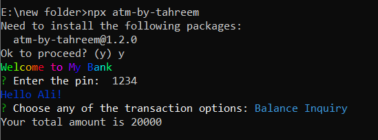

# CLI-ATM Project
## Project Description
This TypeScript ATM (Automated Teller Machine) project provides a simplified command-line-based ATM system with key features for managing your account, including withdrawing funds, checking your balance, and adding funds to your account.


## Features

- **Withdraw Amount:** Use this feature to withdraw a specific amount from your account. The system will verify your account balance and allow you to withdraw if sufficient funds are available.
- **Balance Inquiry:** You can inquire about your account balance at any time. The system will display your current balance.
- **Add Amount:** Use this feature to deposit or add funds to your account. The added amount will be reflected in your account balance.


## Usage
1. Clone or download the project repository.

2. Open a command-line terminal and navigate to the project directory.

3. Run the application using TypeScript. For example:

To run this project:
```TypeScript
npx atm-by-tahreem
```
**The user name is "Ali", user pin is 1234, user balance is 20000**

## Technology used

- Typescript
- Node.js (for running the application)

## Screenshot
