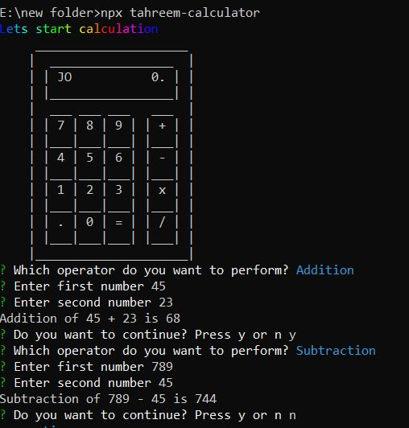

# CLI-Calculator

A Command-Line Interface (CLI) Calculator built using TypeScript allows users to perform basic arithmetic operations such as addition, subtraction, multiplication, and division on two numbers. Here's an overview of its functionality:


## Deployment

To deploy this project run

```bash
  npx tahreem-calculator
```

To install this package run
```bash
  npm i tahreem-calculator
```
## Functionality

- User-Friendly Interface: The calculator presents a user-friendly interface in the command line where users can input their desired operations.
- Operations: The calculator supports four primary arithmetic operations:

    - Addition (+)
    - Subtraction (-)
    - Multiplication (*)
    - Division (/)
- User Input: Users are prompted to enter the operation they want to perform and provide two numerical values for the calculation.
- Calculation: Once the user enters the operation and numbers, the calculator processes the input and calculates the result according to the specified operation.

- Display Result: The result of the calculation is displayed in the command line for the user to see.

- Repeat or Quit: After displaying the result, the user has the option to repeat the calculation with new numbers or to exit the calculator.


