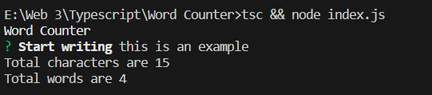

# Word Counter CLI

The Character and Word Counter CLI is a simple TypeScript-based command-line tool that allows you to quickly count characters and words in an English paragraph while ignoring whitespaces. It's a handy utility for tasks such as character limits for text inputs.

## Features

- Count characters in an English paragraph.
- Count words in an English paragraph without considering spaces, tabs, or newlines.
- User-friendly command-line interface.

## Deployment

To deploy this project run

```bash
  npx word-counter-by-tahreem
```

## Screenshot

