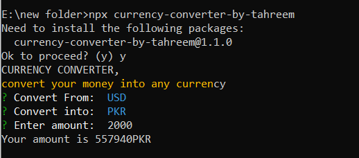

# CURRENCY CONVERTER

The Currency Converter is a simple and user-friendly tool that allows you to quickly convert between two commonly used currencies: USD (United States Dollar) and PKR (Pakistani Rupee). Whether you're traveling, making international transactions, or just curious about the current exchange rate, this tool provides a convenient way to perform currency conversions.


## Features

- Convert from USD to PKR: Input an amount in US Dollars, and the converter will provide the equivalent amount in Pakistani Rupees.
- Convert from PKR to USD: If you have an amount in Pakistani Rupees and need to know its value in US Dollars, simply enter the PKR amount, and the converter will give you the USD equivalent.

Enjoy hassle-free currency conversion with the Currency Converter project.


## Deployment

To deploy this project run

```bash
  npx currency-converter-by-tahreem
```

## Screenshot
